### PLAN

## DESIGN PATTERNS

1. **Singleton**: Ensures that there is only one instance of the server managing all connections and games.
2. **Abstract Factory**: Allows for the creation of different game variants (standard and custom boards and rules) without changing the main game logic.
3. **Factory Method**: Responsible for creating appropriate instances of boards and game rules.
4. **Observer**: Notifies players about moves, allowing them to see the effects of moves made by other players.
5. **Strategy**: Allows for dynamic assignment of different sets of game rules.
6. **Facade**: Simplifies client operations by providing a unified interface to manage the connection, input, and output.
7. **State**: Manages the different states of the game (waiting for players, player's turn, game over) and changes the behavior of the game based on its state.


## CODE FOR WHOLEIDEA UML

```uml
src/
├── server/
│   ├── GameServer.java
│   ├── PlayerHandler.java
│   ├── ServerSocket.java
│   └── ClientSocket.java
├── game/
│   ├── Game.java
│   ├── state/
│   │   ├── GameState.java          // Interface
│   │   ├── WaitingForPlayersState.java
│   │   ├── PlayerTurnState.java
│   │   ├── GameOverState.java
│   ├── board/
│   │   ├── Board.java              // Interface
│   │   ├── StandardBoard.java
│   │   ├── CustomBoard.java
│   ├── Position.java
│   └── Move.java
├── rules/
│   ├── GameRuleSet.java            // Interface
│   ├── StandardRuleSet.java
│   └── CustomRuleSet.java
├── factories/
│   ├── GameFactory.java            // Abstract Method
│   ├── StandardGameFactory.java
│   └── CustomGameFactory.java
├── client/
│   ├── GameClient.java
│   ├── ClientConnection.java
│   ├── ClientInputHandler.java
│   └── ClientOutputHandler.java
└── utils/
    └── Utils.java
```

### Zaktualizowany diagram UML

```plantuml
@startuml
' Struktura pakietów i relacji

package "server" {
    class GameServer {
        - players: List<Player>
        - game: Game
        + startGame(): void
        + waitForPlayers(): void
        + handleGame(): void
    }

    class PlayerHandler {
        - player: Player
        - clientSocket: ClientSocket
        + handlePlayer(): void
    }

    class ServerSocket {
        - socket: Socket
        + listen(): void
        + acceptConnection(): ClientSocket
    }

    class ClientSocket {
        - socket: Socket
        + sendMessage(message: String): void
        + receiveMessage(): String
    }

    GameServer --> PlayerHandler : manages
    PlayerHandler --> ClientSocket : uses
    GameServer --> Game : starts
    ServerSocket --> ClientSocket : connects >
    PlayerHandler --> Player : handles
}

package "game" {
    class Game {
        - board: Board
        - players: List<Player>
        - currentPlayer: Player
        - state: GameState
        + start(): void
        + makeMove(move: Move): void
        + getCurrentPlayer(): Player
        + setState(state: GameState): void
        + allPlayersConnected(): boolean
        + isGameOver(): boolean
        + nextPlayer(): void
    }

    interface GameState {
        + handle(game: Game): void
    }

    class WaitingForPlayersState {
        + handle(game: Game): void
    }

    class PlayerTurnState {
        + handle(game: Game): void
    }

    class GameOverState {
        + handle(game: Game): void
    }

    interface Board {
        + setup(): void
        + getBoardState(): String
    }

    class StandardBoard {
        + setup(): void
        + getBoardState(): String
    }

    class CustomBoard {
        + setup(): void
        + getBoardState(): String
    }

    class Position {
        - x: int
        - y: int
        + getPosition(): String
    }

    class Move {
        - from: Position
        - to: Position
        + executeMove(): void
    }

    Game --> Board : has
    Game --> Player : has
    Game --> GameRuleSet : uses
    Game --> Move : handles
    Game --> GameState : uses
    GameState <|-- WaitingForPlayersState
    GameState <|-- PlayerTurnState
    GameState <|-- GameOverState
    Board <|-- StandardBoard
    Board <|-- CustomBoard
}

package "rules" {
    interface GameRuleSet {
        + applyRules(): void
    }

    class StandardRuleSet {
        + applyRules(): void
    }

    class CustomRuleSet {
        + applyRules(): void
    }

    GameRuleSet <|-- StandardRuleSet
    GameRuleSet <|-- CustomRuleSet
}

package "factories" {
    abstract class GameFactory {
        + createBoard(): Board
        + createGameRuleSet(): GameRuleSet
    }

    class StandardGameFactory {
        + createBoard(): Board
        + createGameRuleSet(): GameRuleSet
    }

    class CustomGameFactory {
        + createBoard(): Board
        + createGameRuleSet(): GameRuleSet
    }

    GameFactory <|-- StandardGameFactory
    GameFactory <|-- CustomGameFactory
    GameFactory --> Board : creates
    GameFactory --> GameRuleSet : creates
}

package "client" {
    class GameClient {
        - connection: ClientConnection
        - inputHandler: ClientInputHandler
        - outputHandler: ClientOutputHandler
        + start(): void
    }

    class ClientConnection {
        - socket: Socket
        - out: PrintWriter
        - in: BufferedReader
        + sendMessage(message: String): void
        + receiveMessage(): String
        + close(): void
    }

    class ClientInputHandler {
        - connection: ClientConnection
        + handleInput(): void
    }

    class ClientOutputHandler {
        - connection: ClientConnection
        + run(): void
    }

    GameClient --> ClientConnection : uses
    GameClient --> ClientInputHandler : uses
    GameClient --> ClientOutputHandler : uses
    ClientInputHandler --> ClientConnection : uses
    ClientOutputHandler --> ClientConnection : uses
}

package "utils" {
    class Utils {
        + generateRandomNumber(): int
    }
}

@enduml
```

